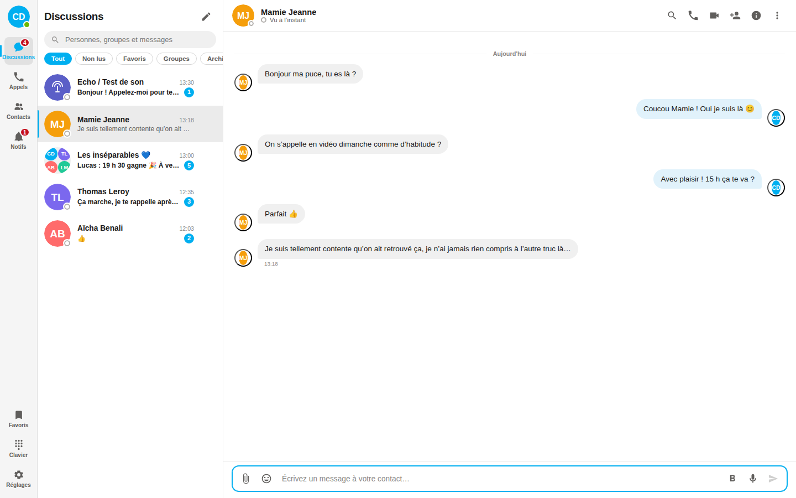
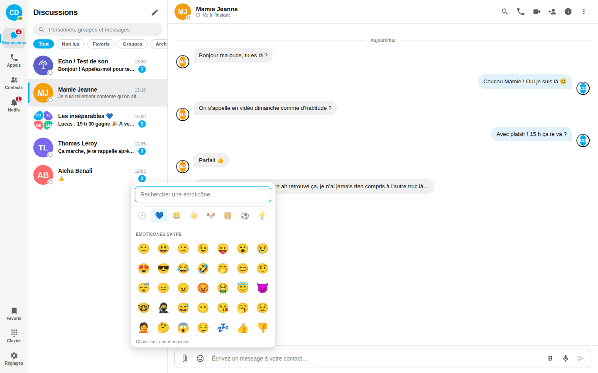
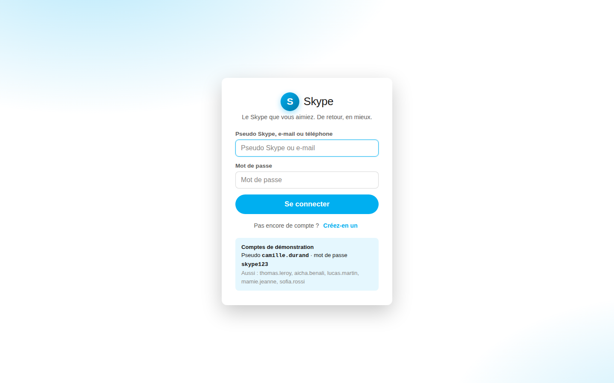

<div align="center">

# Skype

**La messagerie, les appels audio et vidéo et le partage d'écran que vous aimiez.
Recréés de A à Z, sans rien oublier.**

Version 8.137.0 · Zéro dépendance · Node.js ≥ 18

**[Télécharger](https://lauzalaiah.github.io/Skype/)** ·
**[Pourquoi ce projet](https://lauzalaiah.github.io/Skype/pub/)** ·
[Toutes les fonctionnalités](docs/FONCTIONNALITES.md) ·
[Héberger son serveur](docs/HEBERGEMENT.md)



</div>

Un **serveur que vous hébergez**, sans société derrière, sans publicité, sans
collecte. Vos conversations restent chez vous, et personne ne peut fermer le
service. Windows, macOS, Linux, plus le navigateur et le téléphone.

> Recréation indépendante réalisée par un fan. Aucun lien avec Microsoft ni
> avec les équipes de Skype. « Skype » est une marque de Microsoft, citée ici
> pour désigner le logiciel d'origine.

<table>
<tr>
<td width="50%"></td>
<td width="50%"></td>
</tr>
</table>

---

## Héberger son serveur : une commande

```bash
git clone https://github.com/Lauzalaiah/Skype && cd Skype
docker compose up -d
```

L'application répond sur `http://<votre-machine>:3000`. Les données vivent dans
`./donnees` — c'est le seul dossier à sauvegarder.

**Avec HTTPS automatique** (indispensable : les navigateurs refusent le micro et
la caméra sans lui, donc pas d'appel) :

```bash
DOMAINE=skype.exemple.fr docker compose --profile https up -d
```

Caddy obtient et renouvelle le certificat tout seul. Il faut seulement que le
nom de domaine pointe sur la machine.

**Sans Docker**, c'est aussi court — le projet n'a aucune dépendance :

```bash
node server/index.js
```

---

## Démarrage en 30 secondes

```bash
npm run seed      # crée 7 comptes de démonstration et leurs conversations
npm start         # démarre le serveur sur http://localhost:3000
```

Ouvrez **http://localhost:3000** et connectez-vous :

| Pseudo Skype | Nom | Mot de passe |
|---|---|---|
| `camille.durand` | Camille Durand *(compte principal)* | `skype123` |
| `thomas.leroy` | Thomas Leroy | `skype123` |
| `aicha.benali` | Aïcha Benali | `skype123` |
| `lucas.martin` | Lucas Martin | `skype123` |
| `mamie.jeanne` | Mamie Jeanne | `skype123` |
| `sofia.rossi` | Sofia Rossi | `skype123` |

> **Pour tester les appels**, ouvrez un second navigateur (ou une fenêtre de navigation
> privée) et connectez-vous avec un autre compte. Les appels audio, vidéo et le partage
> d'écran fonctionnent réellement, en pair-à-pair via WebRTC.

La publicité de lancement est servie sur **http://localhost:3000/pub**.

### Autres commandes

```bash
npm run dev       # démarrage avec rechargement automatique
npm run reset     # remet la base à zéro et recrée les comptes de démonstration
npm test          # 256 tests de bout en bout (API, temps réel, sécurité, sons) — Node 22+
PORT=8080 npm start
```

---

## Ce qu'il y a dedans

Tout Skype, jusqu'aux détails. Le détail complet se trouve dans
[`docs/FONCTIONNALITES.md`](docs/FONCTIONNALITES.md) — en résumé :

**Messagerie** — conversations individuelles et de groupe, texte enrichi
(`*gras*`, `_italique_`, `~barré~`, blocs de code), réponses citées, modification,
suppression pour soi ou pour tous, transfert, mentions `@pseudo`, réactions, accusés
de lecture, indicateur de saisie, brouillons, messages favoris, séparateurs de jour
et de nouveaux messages.

**Émoticônes** — les 80 classiques de Skype avec leurs raccourcis d'origine
(`(y)`, `(rofl)`, `(cool)`, `(party)`…) plus 1 800 émojis modernes, recherche,
récents, et affichage géant quand un message ne contient que des émojis.

**Appels** — audio et vidéo, en tête-à-tête ou en groupe (maillage WebRTC complet),
partage d'écran, coupure du micro, main levée, sous-titres en direct, vue grille ou
intervenant, détection de la personne qui parle, réduction de bruit, réponses rapides
sur appel entrant, historique et appels manqués.

**Téléphonie** — pavé numérique avec tonalités DTMF, appels vers les numéros fixes et
mobiles décomptés du crédit Skype, attribution d'un numéro Skype.

**Groupes** — administrateurs, photo, renommage, lien d'invitation, ajout et retrait de
participants, sondages avec choix simple ou multiple.

**Fichiers** — glisser-déposer jusqu'à 64 Mo, images, vidéos, documents, messages
vocaux enregistrés au micro, galerie de médias, historique des fichiers et des liens.

**Présence** — En ligne, Absent, Ne pas déranger, Invisible, Hors ligne, passage
automatique en Absent après 5 minutes d'inactivité, « vu il y a… ».

**Personnalisation** — thèmes Clair, Sombre, **Skype Classic** (le bleu d'origine) et
Contraste élevé, six couleurs d'accentuation, quatre tailles de texte, densité de liste.

**Le reste** — recherche universelle, notifications système et sonores, les **sons
d'origine de Skype** (message, sonnerie au choix, tonalité d'appel, connexion,
fichier reçu, appel en attente…), blocage, confidentialité fine, export des
données, raccourcis clavier, interface mobile, PWA installable.

### Ajouter un son

Les sons vivent dans `public/assets/sounds/` et sont déclarés dans un seul
tableau, en haut de `public/js/lib/sounds.js` :

```js
export const BIBLIOTHEQUE = {
  message: { file: 'skype-message.mp3', label: 'Message reçu', eager: true, secours: [...] },
  ring:    { file: 'skype-ring.mp3',    label: 'Sonnerie — classique', loop: true, ... },
  // …
};
```

Déposez le fichier, ajoutez une ligne, et le son apparaît automatiquement dans
la bibliothèque des réglages. `secours` contient les notes de synthèse jouées
si le fichier venait à manquer.

---

## Architecture

```
server/          Node.js pur, aucune dépendance
  index.js       serveur HTTP + fichiers statiques + montage WebSocket
  ws.js          implémentation WebSocket (RFC 6455) écrite à la main
  api.js         API REST (auth, contacts, conversations, messages, fichiers)
  models.js      logique métier et vues publiques des données
  realtime.js    présence, saisie en cours, signalisation WebRTC
  store.js       persistance JSON atomique
  seed.js        données de démonstration

public/          Application web, modules ES natifs, aucun outil de build
  css/           thème, base, mise en page, conversation, composants, appels
  js/
    lib/         dom, icônes, formatage, dates, sons, client API, client WebSocket
    ui/          authentification, rail, panneau latéral, conversation, messages,
                 rédaction, émoticônes, appels, réglages, détails, modales
    state.js     état global et abonnements
    app.js       amorçage, événements temps réel, raccourcis clavier
  pub/           la publicité de lancement

ad/campagne.md   films, spots radio, affichage, réseaux sociaux, e-mail de reconquête
docs/            documentation, et index.html : le site de téléchargement
test/            tests de bout en bout
data/            base JSON et fichiers envoyés (créé au premier lancement)
```

**Aucune dépendance npm.** Le serveur WebSocket, la persistance, le routage HTTP et
toute l'interface sont écrits directement sur les API de Node.js et du navigateur.
`npm install` n'a rien à installer ; il suffit de `node server/index.js`.

---

## Comment ça marche

**Temps réel** — un WebSocket par session porte la présence, la saisie en cours, les
messages, les réactions et toute la signalisation d'appel. Reconnexion automatique avec
attente exponentielle et resynchronisation des messages manqués.

**Appels** — WebRTC en pair-à-pair. Le serveur ne relaie que les offres SDP et les
candidats ICE : **l'audio et la vidéo ne transitent jamais par lui**. Les appels de
groupe utilisent un maillage complet (chaque participant est connecté à tous les
autres), ce qui convient jusqu'à environ 6 personnes.

**Sécurité** — mots de passe hachés avec `scrypt` et un sel unique, comparaison à temps
constant, jetons de session de 256 bits, échappement HTML systématique avant tout rendu
de contenu utilisateur, protection contre la traversée de répertoire, contrôle
d'appartenance sur chaque conversation, blocage respecté côté serveur.

**Données** — tout est stocké dans `data/skype.json` et `data/files/`. Rien ne sort de
votre machine. Aucun traceur, aucun service tiers, aucune police ni script distant.

---

## Tests

```bash
npm test
```

256 tests couvrent l'inscription et la connexion, le rejet des identifiants invalides,
les demandes de contact, les permissions de conversation, l'édition et la suppression
de messages, les réactions, les sondages, les rôles d'administrateur, les liens
d'invitation, le blocage, la fusion des réglages imbriqués, le crédit Skype, l'envoi
et le téléchargement de fichiers, la diffusion WebSocket et le refus des jetons
invalides, la correspondance de chaque son avec son événement, l'honnêteté de la page
de campagne et du site de téléchargement.

La suite demande **Node 22 ou plus** : elle se connecte au serveur avec le client
WebSocket natif, absent des versions antérieures. Le serveur, lui, tourne dès Node 18.

L'interface a été validée dans Chromium sur 30 scénarios de bout en bout, y compris un
appel vidéo réellement établi entre deux sessions.

---

## Raccourcis clavier

| Action | Raccourci |
|---|---|
| Nouvelle conversation | `Ctrl + N` |
| Rechercher | `Ctrl + F` |
| Conversation suivante / précédente | `Ctrl + ⇧ + ↓` / `↑` |
| Appel audio / vidéo | `Ctrl + ⇧ + P` / `K` |
| Raccrocher | `Ctrl + ⇧ + H` |
| Modifier le dernier message | `↑` dans un champ vide |
| Thème sombre | `Ctrl + ⇧ + D` |
| Réglages | `Ctrl + ,` |
| Tous les raccourcis | `Ctrl + /` |

---

## Compatibilité

Chrome, Edge, Firefox et Safari récents. Les appels nécessitent HTTPS en dehors de
`localhost` (contrainte des navigateurs sur `getUserMedia`). L'application est
installable en PWA et s'adapte aux écrans mobiles.

---

<div align="center">

Projet indépendant de restauration, **créé par un fan**, sans aucun lien avec
Microsoft ni avec les équipes de Skype. « Skype » est une marque de Microsoft,
citée ici pour désigner le logiciel d'origine.

## Mise en service

L'application est un client : elle a besoin d'un serveur joignable en HTTPS.
La marche à suivre — serveur, certificat, WebSocket derrière un proxy, TURN
pour les appels — est dans [`docs/HEBERGEMENT.md`](docs/HEBERGEMENT.md).

## Sur iPhone

L'application s'installe sur l'écran d'accueil depuis Safari (Partager → Sur
l'écran d'accueil) : plein écran, icône, ouverture hors ligne. Il faut servir
le site en HTTPS — iOS refuse le micro et la caméra sans cela.

Un `.ipa` ne peut pas être produit ailleurs que sur macOS avec Xcode et un
certificat Apple. Le projet Capacitor et le workflow de build sont fournis dans
[`ios/README.md`](ios/README.md).

## Sur PC

Une vraie application de bureau — icône, menu Démarrer, raccourci sur le
bureau, installateur classique — construite avec Electron. Contrairement à
l'iOS, aucun compte développeur n'est nécessaire : un `.exe` Windows s'installe
sans certificat. Elle embarque son propre serveur : aucune adresse à
configurer, aucune connexion Internet requise une fois installée.

Par défaut elle utilise le serveur qu'elle embarque — donc **seule**. Pour
parler à quelqu'un d'autre, les deux installations doivent viser le même
serveur : « Changer de serveur » sur l'écran de connexion, et la fenêtre se
recharge dessus. Monter ce serveur : [`docs/HEBERGEMENT.md`](docs/HEBERGEMENT.md).

Elle **se met à jour toute seule** sous Windows et Linux : vérification
discrète, téléchargement en arrière-plan, puis un bandeau « Redémarrer
maintenant ». macOS fait exception — se remplacer soi-même y exige une
signature Apple que ce projet n'a pas ; l'application y signale la nouvelle
version et renvoie vers la page de téléchargement.

```bash
cd desktop && npm install && npm run build:win
```

Ou depuis GitHub Actions (onglet **Actions** → **Windows** → **Run
workflow**), qui construit sur un exécuteur Windows réel. Détails dans
[`desktop/README.md`](desktop/README.md).

## Le site de téléchargement

`docs/index.html` est une page de téléchargement complète, servie gratuitement
par GitHub Pages sur **https://lauzalaiah.github.io/Skype/**. Elle ne contient
aucun lien écrit à la main : elle lit la dernière version publiée par le
workflow **Publier une version**, qui construit l'application sur Windows,
macOS et Linux et attache les trois fichiers — plus leurs empreintes SHA-256 —
à une *release* du dépôt.

Mise en service et règles de la page : [`docs/SITE.md`](docs/SITE.md).

Fait pour ceux qui n'ont jamais voulu changer. 💙

</div>
